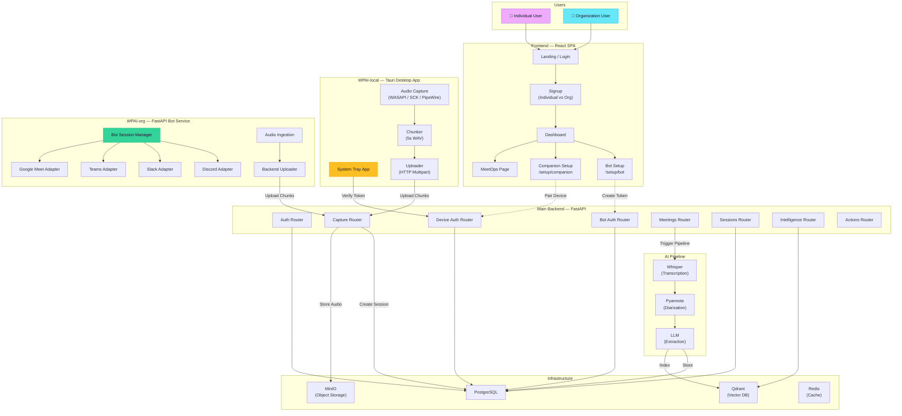
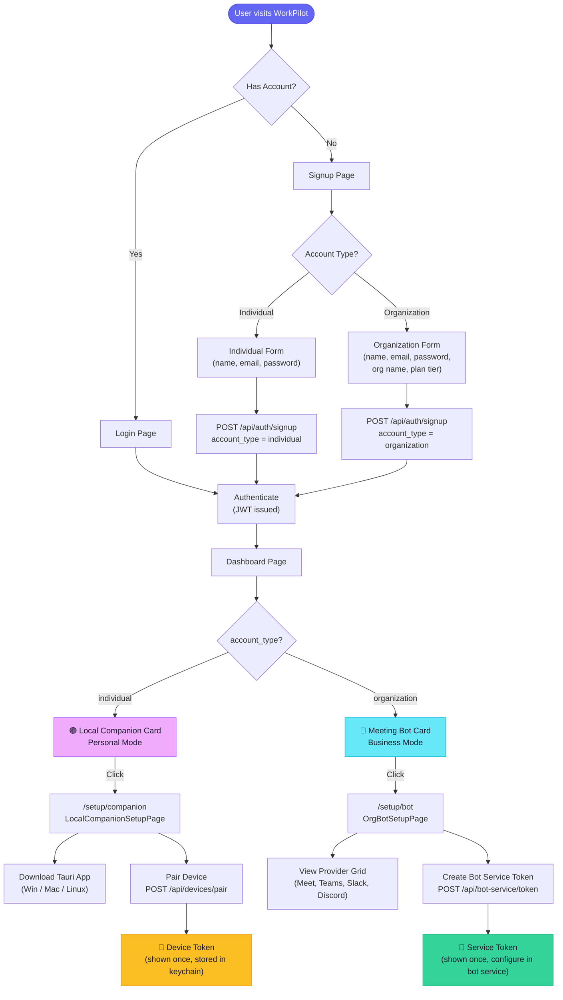
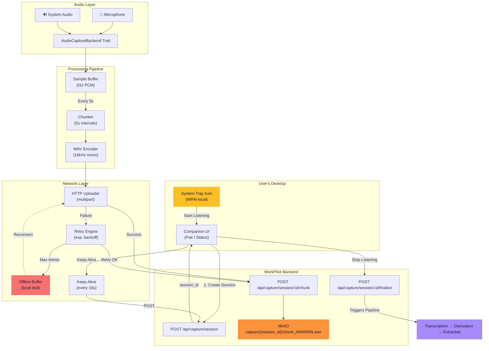
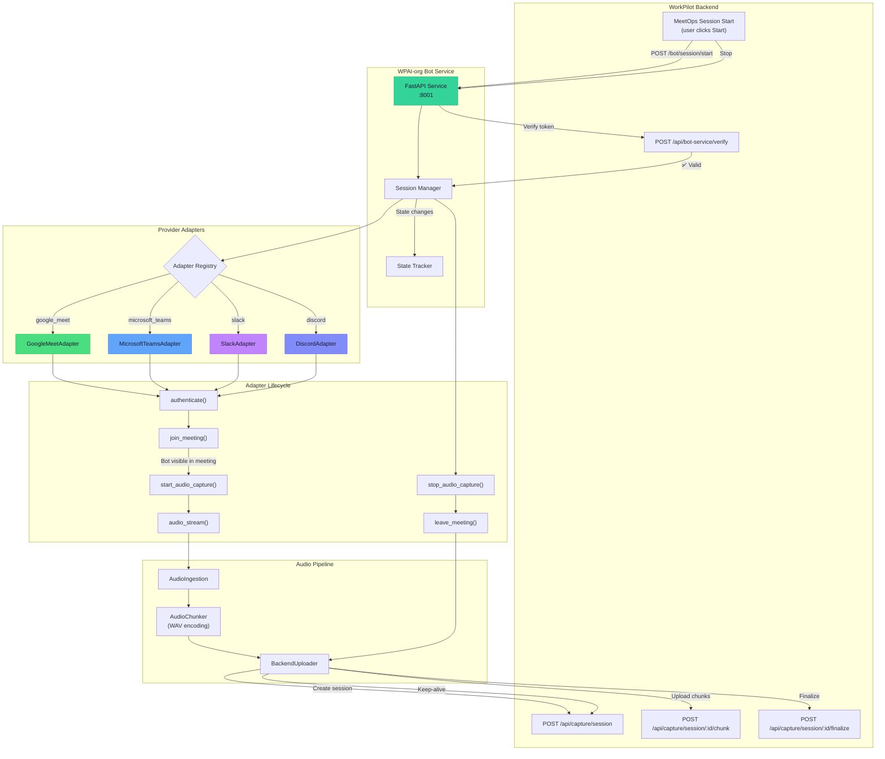
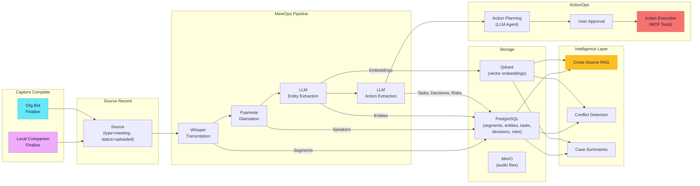
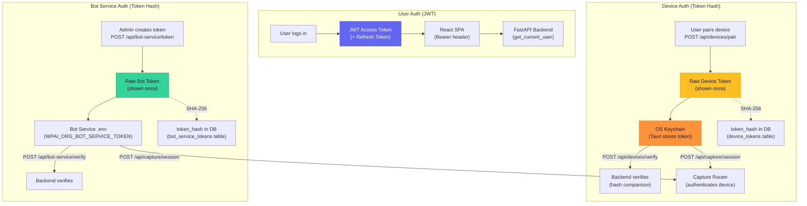
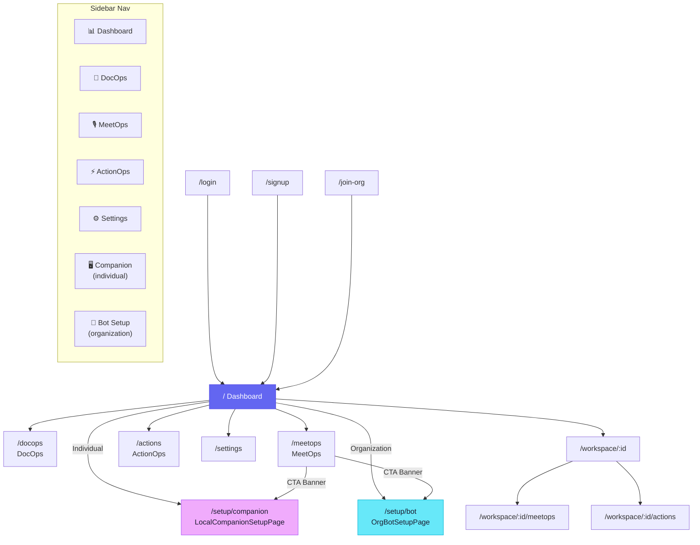
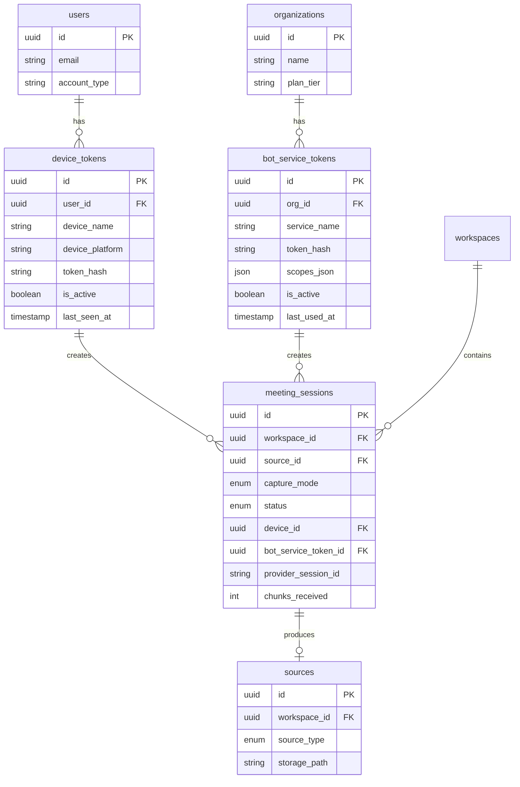

# WorkPilot AI — Architecture & User Flow

## 1. High-Level System Topology

---

## 2. User Onboarding — Account Type Branching

---

## 3. Individual Mode — Local Companion Capture Flow

---

## 4. Organization Mode — Bot Service Capture Flow

---

## 5. Shared Pipeline — Transcript to Intelligence

Both capture modes feed into the same downstream pipeline:

---

## 6. Authentication Model

---

## 7. Frontend Navigation Map

---

## 8. Database Entity Relationships (New Tables)

